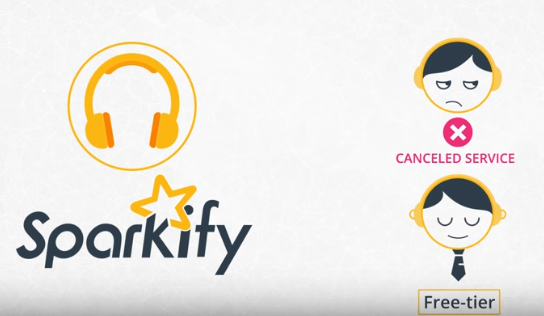

# Spark Project: Sparkify

## Table of contents

- [Spark Project: Sparkify](#spark-project-sparkify)
  - [Table of contents](#table-of-contents)
  - [Introduction](#introduction)
  - [Installation](#installation)
  - [Analysis and Results](#analysis-results)
  - [Conclusion](#conclusion)
  - [Licence and Acknowledgements](#licence-and-acknowledgements)


## High-level overview of the project



**Problem domain:** 

* **Predicting user churn** **for a popular imaginary digital music streaming service Sparkify.**
* **AIM:** **manipulate Sparkify dataset with Spark to engineer relevant features for predicting churn.**


**Additional information**

Users stream their favorite songs to Sparkify streaming service every day using Free-tier or using the premium subscription model. Users can upgrade, downgrade or cancel their service at any time. Every time a user interacts with the service while they are playing songs, logging out, liking a song with a thumbs up, hearing an add or downgrading a service - it generates data. All this data contains the key insights for keeping your users happy and helping your business thrive. The main task is to predict which users are at risk to churn either downgrading from premium to free-tier or cancelling their service altogether. If the users can be accurately identified before they leave, Sparkify as a business can offer them discounts and incentives, potentially saving Sparkify millions in revenue.


**Project Origin:** This is the capstone project for [Udacity's Data Science Nanodegree](https://www.udacity.com/course/data-scientist-nanodegree--nd025).


**Input Data:**  For this project we are given user log data of sizes mini, medium and large. I have  decided to use `mini_sparkify_event_data.json` which is only a mini-subset (200ish MBs) of the full dataset (12GB).


**What is churn prediction?**

* Predicting churn rates is a challenging and common problem that data scientists and analysts regularly encounter in any customer-facing business. 
* **Churn prediction** uses big data to detect customers who are likely to cancel their  subscriptions and is used by most of the large subscription businesses  to identify customers most at-risk of **churning**. Done well, it leads to huge business savings, regardless of size.


**Strategy and steps for solving the problem:**

1. **Load Data into Spark**
   * We will load user activity log data  `mini_sparkify_event_data.json` into pyspark which is only a mini-subset (200ish MBs) of the full dataset (12GB). Spark will be run in the local mode on my laptop.
2. **Clean and Explore Data**
   * Since we didn't get any documentation about the data like data dictionary, we will get familiar with the data, describe data and individual column distributions, identify and deal with missing and duplicate values, identify and deal with any other issues we stumble upon. Last step will be to create a churn flag when a column `page`  is equal to `Cancellation Confirmation` events which happens for both paid and free users. Once we defined `curn`, we will perform some exploratory data analysis to observe the behavior for users who stayed vs users who churned
3. **Create Features**
   * Once we familiarized ourselves with the data, we will build out the features that we find promising to train our model on. 
4. **Build Models and Predict Churn**
   * Once the features are ready, we will split the dataset into train, test and validation sets. 
   * We will use the machine learning APIs within Spark ML to build and tune models. In particular, we will utilize **Logistic regression** and **Random forest ML algorithms.**
   * Based on the chosen metric, we will evaluate predictions and choose algorithm that performs better and make an attempt to tune the model by applying grid search and cross validation.

**Metric:**

* Our problem is binary classification, 0 or 1, if user did not or did churn.

* **F1 metric** is a recommended metric to use for the task given where our churned users are a **fairly small and imbalanced dataset.**

* **F1 is weighted average (harmonic mean)** of the precision and recall scores.  This score can range from 0 to 1, with 1 being the best possible F1.

  

## Local Installation on Win 10 OS

* Windows 10 OS
* Visual Studio Code as an text editor and development environment.
  
  * python extension from VS code's marketplace
* [How to install PySpark to run in Jupyter Notebook on Windows ?](https://medium.com/@naomi.fridman/install-pyspark-to-run-on-jupyter-notebook-on-windows-4ec2009de21f)
* Mini-Conda from which I used conda as package and environment manager.
  * in Anaconda Prompt run following to create correct python environment with all necessary packages:
    * `conda create --name sparkify python=python=3.7 numpy pandas jupyter matplotlib seaborn findspark pyspark handyspark`
    
    * after setting up the environment run `activate sparkify`
    
    * clone github repository to your local machine, open the cloned repo with Visual Studio Code's open folder, and choose correct environment sparkify.
    
    * Jupyter notebook with analysis is located [here](./Sparkify.ipynb)
    
      

## Analysis and Results ([full analysis available in Jupyter Notebook](https://github.com/baky0905/sparkify-dsnd/blob/master/Sparkify.ipynb))

### **1. Load Data into Spark**

Load mini subset `mini_sparkify_event_data.json` of the data into Spark and manipulate them Spark Dataframes. The full dataset is 12GB and for that I would have to deploy a Spark cluster using AWS, IBM Cloud or Azure. This is a task that I will postpone as a future extension of the project (mentioned in the improvements section).

#### **Dataset and column description**

This is how our dataset in question looks in its raw form after loading it to Spark.

```
root
 |-- artist: string (nullable = true)
 |-- auth: string (nullable = true)
 |-- firstName: string (nullable = true)
 |-- gender: string (nullable = true)
 |-- itemInSession: long (nullable = true)
 |-- lastName: string (nullable = true)
 |-- length: double (nullable = true)
 |-- level: string (nullable = true)
 |-- location: string (nullable = true)
 |-- method: string (nullable = true)
 |-- page: string (nullable = true)
 |-- registration: long (nullable = true)
 |-- sessionId: long (nullable = true)
 |-- song: string (nullable = true)
 |-- status: long (nullable = true)
 |-- ts: long (nullable = true)
 |-- userAgent: string (nullable = true)
 |-- userId: string (nullable = true)
```

We can cluster the columns into three categories, first one that describes a user, second that describes how a user interacts with the Sparkify service and third that describes song level information.

**Columns that describe a user:**

- `firstName`: string - first name of a user
- `gender` string - gender of a user
- `lastName`: string - last name of a user
- `location`: string - location of a user
- `registration`: long - timestamp of when a user registered to sparkify service
- `userAgent`: string - agent which the user user for accessing sparkify service
- `userId`: string - identifier of a user
- `level`: string - describes if user is on a free or paid subscription level. Keep in mind that a user can both be free and paid as the time progresses, i.e. it is not as static as the other columns above.


**Columns that describe how a user interacts with the sparkify service:**

- `auth: string` - cathegories of the authentication. It can be either of the 4: Logged in, Logged out, Cancelled and Guest

- `itemInSession`: long - count of logs per session

- `method`: string - method for an http request, it is either GET or PUT method type.

- `page`: string - this column describes a category of an interaction for a log. 22 categories (Cancel, Submit Downgrade, Thumbs Down, Home,...)

- `sessionId`: long - id of a session where the log occurred

- `status`: long - status code of a http response, there are three categories in the dataset (200 - OK, 307 - temporary redirect, 404 - Not Found )

- `ts`: long - log's timestamp

  


**Columns that describe song level information:**

- `artist`: string - name of the artist
- `song`: string - name of the song
- `length`: double - length of the song in seconds


### 2. Clean and Explore Data

#### **Summary about mini Sparkify dataset and comments from exploring the data:**

- `286500` rows
- `18` columns
- `8346` have no values for **userId** and most of the other columns are also null. It occurs when authentication level in the **auth** column is either **Guest** of **Logged Out**. These rows are dropped from the dataset.
- there is no duplicates in the mini size dataset
- There is no empty **sessionId** values.
- logs have been gathered from `1st October 2018 (02:00:11)` to `3rd of December 2018 (02:11:16)`
- users registrations are from `18th of March 2017` to `26th of November 2018`.
- `225` unique users
- `2312` unique sessions
- `23 %` of the users have churned - **imbalanced dataset.**


#### **Data cleaning steps:**

* **8346 UserIds** with empty string values have been dropped from the dataset. When **userId** has empty string, it corresponds to the `auth` column being either `Logged Out` or `Guest` values.
* **ts** and **registration** columns have been converted from unix time to datetime
* **hour** and **day** of the month was extracted from the ts (time) column (not used in the current version for feature engineering)
* **churn** was defined when **page** column logged  **'Cancellation Confirmation'** interaction


####  **Data Analysis**

Summary statistics for a number of columns can be seen below. 

**gender**

Gender distribution between users is balanced.


**level**

Users can either use the service in a free mode or as a paid subscription, and they are distributed approximately half half. We can also see that the sum of the users is 360 which is more than 225 unique users, and that just confirms that some of the users downgraded and some upgraded their service.


**page**

82% of the user events is a **Next Song** action which makes it a 


**status**

Very small percentage of users experienced a response that is different than 200 - OK. 


**churn**

Churn is the flag that tells us if the user has canceled (1) their streaming service or not (0). `23 %` of the users have churned which makes it an **imbalanced dataset.** Important to think and incorporate when choosing a machine learning algorithm and how we evaluate its results, i.e. metrics.


#### 3. **Create Features**

I have created 8 features that cover the observation period which will be used in the predictive model to predict if the user will or will not churn. Below I have described what engineered features represent:

* **friends_count** - total count of friends a user has
* **thumbs_up_count** - total count of thumbs ups per user
* **thumbs_count_down** -  total count of thumbs downs per user
* **error_count** -  total count of errors per user
* **artist_count **-  total count of artists a user has listened to
* **song_count** -  total count of songs a user has listened to
* **gender** - gender of a user (encoded as 0 - female, 1- male)
* **session_time_mean** - mean session time per user


After performing an inner join between all calculated/engineered features, the number of users reduced from **225 to 115**.

**Pairplot of all features hued by churn column**

There are few things that we can summarize from the pair plot:

* Some of the features are corelated and that will be summarized and elaborated in the next section.

* most of the engineered features like for example friends_count, thumbs_up_count, thumbs_down_count and error_count columns for churned users are narrower and smaller in magnitude than for non-churned users **BUT** keep in mind that the dataset in hand is only a mini subset and may not be representative of the full customer base.

  


**Any correlation between features?**

From the correlation matrix we can see that there are collinearity between the features. I decided to drop one of the features that are colinear and have correlation factor larger than 0.9. The column in question is **artist_count** column.


### **Build Models and Predict Churn**

#### **Feature dataset summary:**

- 7 numerical features are going as input features for a model to train and predict on - 'friends_count', 'thumbs_up_count', 'thumbs_down_count', 'error_count', 'song_count', 'session_time_mean',  'gender'

Dataset was split into train and test, in a ratio of 70:30 which ended up with 71 rows in train and 44 rows in test data.

#### **Metric:**

* F1 score

  * **F1 metric** is a recommended metric to use for the task given where our churned users are a **fairly small and imbalanced dataset.**

* Results:

  * Random forest gave the F1 of 83% and by tuning its hyperparameters the F1 surprisingly dropped to 77%.
  
  

It is important to highlight that these results were obtained using the mini Sparkify dataset which contains only 115 unique users and their aggregated log actions. Model was trained on 71 and tested on only 44 user aggregated data, this is a very small dataset and performance evaluation results are uncertain. We would need to evaluate training and testing on the full dataset in order to be able to put more weight on the evaluation metrics.


#### **Transformation pipeline:**

* VectorAssembler
  * A feature transformer that merges multiple columns into a vector column.
* StandardScaler
  * Standardizes features by removing the mean and scaling to unit variance using column summary statistics on the samples in the training set.
* Logistic Regression
  * Model fitted by LogisticRegression.  This class supports multinomial logistic (softmax) and binomial logistic regression.
* Random Forest
  * [Random Forest](http://en.wikipedia.org/wiki/Random_forest) learning algorithm for classification. It supports both binary and multiclass labels, as well as both continuous and categorical features.


#### **Model Tuning**

* ParametersGrid - Builder for a param grid used in grid search-based model selection.

  * ```
    parametersGrid = (ParamGridBuilder()
                 .addGrid(rand_forest.maxDepth, [2, 6, 8]) # default = 5
                 .addGrid(rand_forest.maxBins, [16, 32, 64]) # default: 32
                 .addGrid(rand_forest.numTrees, [10, 20, 30]) # default: 20
                 .build())
    ```

    

* CrossValidator

  * CrossValidatorModel contains the model with the highest average cross-validation metric across folds and uses this model to transform input data. CrossValidatorModel also tracks the metrics for each param map evaluated.

Random forest gave the F1 of 83% and by tuning its hyperparameters the F1 **surprisingly dropped to 77%.**

I have decided to keep to the default Random Forest algorithm hyper parameters given that CrossValidator based on the grid of parameters have chosen a different set of hyper parameters that gave lower F1 score.:

* maxDepth = 5
* maxBins = 32
* numTrees = 20

#### **Feature Importance**

Estimates of the importance of each feature. This feature importance is calculated as follows: importance(feature j) = sum (over nodes which split on feature j) of the gain, where gain is scaled by the number of instances passing through node Normalize importances for tree to sum to 1.

**Based on the figure below, it is evident that gender and error_count could maybe be dropped since their importance in the predictive model are not significant.**


## Conclusion

Machine Learning with Spark is fit for problems and domains where we need to process very large datasets, create models, predict outcomes and evaluate results. Based on the prediction, business should  gain actionable insights that benefit the business and its revenues. 

In the project we used Sparkify action log/event data by evaluating `18` columns from `286500` rows, with a main goal to identify users that have churned. We ended up with `8`aggregated features on the user level which were used to train model for predicting the churn. Features that were engineered were: friends_count - total count of friends a user has, thumbs_up_count - total count of thumbs ups per user, thumbs_count_down -  total count of thumbs downs per user, error_count -  total count of errors per user, artist_count -  total count of artists a user has listened to, song_count -  total count of songs a user has listened to, gender - gender of a user (encoded as 0 - female, 1- male), and session_time_mean - mean session time per user.

The problem to model is a binary classification problem where based on the engineered features, the aim is to predict either 0 or 1 values, 0 if user will not churn and 1 if users will churn. 

We used the machine learning APIs within Spark ML to build and tune models. In particular, we utilized **Logistic regression** and **Random forest ML algorithms.** Based on the chosen metric - F1 score, we evaluated predictions and chosen **Random forest ML algorithm** which performed better. Afterwards we made an attempt to tune the model by applying grid search and cross validation. 

Random forest gave the F1 of 83% and by tuning its hyperparameters the F1 surprisingly dropped to 77%.

To reiterate and conclude, the main task was to predict which users are at risk to churn by cancelling their service altogether. **If the users can be accurately identified before they leave, Sparkify as a business can offer them discounts and incentives, potentially saving Sparkify millions in revenue.**


## **Improvements**

* Engineer more features that are time based, hourly and daily event aggregates. In addition, investigate impact of user agent on churn rate.
* Utilize the full dataset on the Spark cluster via one of the cloud providers in order to represent the customer base more holistically rather than only evaluating an order of 100-200 users. This would be a proper stress test of the validity of a chosen model and hyper parameters.
* Run experiments - A/B testing in order to address the user interface and user experience issues.
* Evaluate more ML algorithms in order to more robustly choose the appropriate algorithm that can deal with binary classification of highly imbalanced datasets.


## Author

Kristijan Bakaric


## License [MIT](https://opensource.org/licenses/MIT)


## Acknowledgements


**Thanks Udacity for an interesting and useful project as a part of the [Data Science Nanodegree](https://www.udacity.com/course/data-scientist-nanodegree--nd025).**


Links that provided additional knowledge and inspiration:

- https://www.youtube.com/watch?v=CdHuLGuU2c4
- https://medium.com/@aieeshashafique/exploratory-data-analysis-using-pyspark-dataframe-in-python-bd55c02a28523
- https://towardsdatascience.com/a-brief-introduction-to-pyspark-ff4284701873
- https://databricks.com/blog/2017/10/30/introducing-vectorized-udfs-for-pyspark.html
- https://towardsdatascience.com/handyspark-bringing-pandas-like-capabilities-to-spark-dataframes-5f1bcea9039e
- https://github.com/dvgodoy/handyspark
- https://towardsdatascience.com/handyspark-bringing-pandas-like-capabilities-to-spark-dataframes-5f1bcea9039e
- https://changhsinlee.com/pyspark-udf/
- https://medium.com/@lukazaplotnik/sparkify-churn-prediction-with-pyspark-da50652f2afc
- https://heartbeat.fritz.ai/seaborn-heatmaps-13-ways-to-customize-correlation-matrix-visualizations-f1c49c816f07
- https://towardsdatascience.com/why-exclude-highly-correlated-features-when-building-regression-model-34d77a90ea8e
- https://www.timlrx.com/2018/06/19/feature-selection-using-feature-importance-score-creating-a-pyspark-estimator/
- https://medium.com/@naomi.fridman/install-pyspark-to-run-on-jupyter-notebook-on-windows-4ec2009de21f


