# Spark Project: Sparkify

## Table of contents

- [Spark Project: Sparkify](#spark-project-sparkify)
  - [Table of contents](#table-of-contents)
  - [Introduction](#introduction)
  - [Installation](#installation)
  - [Results](#results)
  - [Licence and Acknowledgements](#licence-and-acknowledgements)


## Introduction

This is the capstone project of a Data Science Nanodegree. 

Predicting churn rates is a challenging and common problem that data  scientists and analysts regularly encounter in any customer-facing  business. Additionally, the ability to efficiently manipulate large  datasets with Spark is one of the highest-demand skills in the field of  data. 

**Aim of this project** 

* **manipulate Sparkify dataset with Spark to engineer relevant features for predicting churn.**


## Local Installation on Win 10 OS

* Windows 10 OS
* Visual Studio Code as an text editor and development environment.
  * python extension from VS code's marketplace
* [How to install PySpark to run in Jupyter Notebook on Windows ?](https://medium.com/@naomi.fridman/install-pyspark-to-run-on-jupyter-notebook-on-windows-4ec2009de21f)
* Mini-Conda from which I used conda as package and environment manager.
  * in Anaconda Prompt run following to create correct python environment with all necessary packages:
    * `conda create --name sparkify python=python=3.7 numpy pandas jupyter matplotlib seaborn findspark pyspark handyspark`
    * after setting up the environment run `activate sparkify
    * clone the github repository to your local machine, open the cloned repo with Visual Studio Code's open folder, and choose correct environment sparkify.
    * Jupyter notebook with analysis is located [here](./Sparkify.ipynb)

## Results

### Project steps

1. **Load Data into Spark**
2.  **Clean and Explore Data**
3. **Create Features**
4. **Build Models and Predict Churn**
   * Use the machine learning APIs within Spark ML to build and tune models.

#### **1. Load Data into Spark**

Load mini subset `mini_sparkify_event_data.json` of the data into Spark and manipulate them Spark Dataframes. The full dataset is 12GB and for that I would have to deploy a Spark cluster using AWS, IBM Cloud or Azure. This is a task that I will postpone as a future extension of the project.

**Dataset and column description**

```
root
 |-- artist: string (nullable = true)
 |-- auth: string (nullable = true)
 |-- firstName: string (nullable = true)
 |-- gender: string (nullable = true)
 |-- itemInSession: long (nullable = true)
 |-- lastName: string (nullable = true)
 |-- length: double (nullable = true)
 |-- level: string (nullable = true)
 |-- location: string (nullable = true)
 |-- method: string (nullable = true)
 |-- page: string (nullable = true)
 |-- registration: long (nullable = true)
 |-- sessionId: long (nullable = true)
 |-- song: string (nullable = true)
 |-- status: long (nullable = true)
 |-- ts: long (nullable = true)
 |-- userAgent: string (nullable = true)
 |-- userId: string (nullable = true)
```


Columns that describe a user

- `firstName`: string - first name of a user
- `gender` string - gender of a user
- `lastName`: string - last name of a user
- `location`: string - location of a user
- `registration`: long - timestamp of when a user registered to sparkify service
- `userAgent`: string - agent which the user user for accessing sparkify service
- `userId`: string - identifier of a user
- `level`: string - describes if user is on a free or paid subscription level. Keep in mind that a user can both be free and paid as the time progresses, i.e. it is not as static as the other columns above.

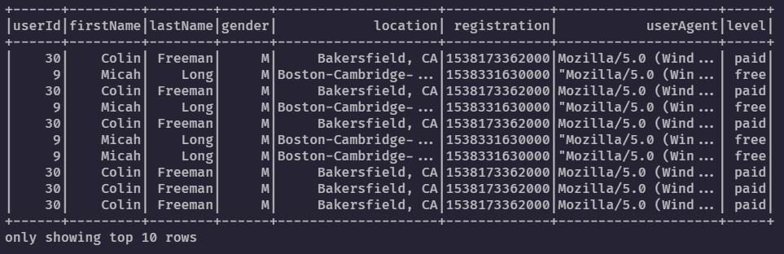


Columns that describe how a user interacts with the sparkify service:

- `auth: string` - cathegories of the authentication. It can be either of the 4: Logged in, Logged out, Cancelled and Guest

- `itemInSession`: long - count of logs per session

- `method`: string - method for an http request, it is either GET or PUT method type.

- `page`: string - this column describes a category of an interaction for a log. 22 categories (Canel, Submit Downgrade, Thumbs Down, Home,...)

- `sessionId`: long - id of a session where the log occured

- `status`: long - status code of a http response, there are three categories in the dataset (200 - OK, 307 - temporary redirect, 404 - Not Found )

- `ts`: long - log's timestamp

  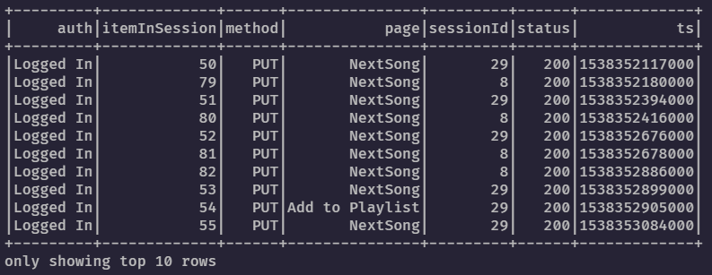


Columns that describe song level information:

- `artist`: string - name of the artist
- `song`: string - name of the song
- `length`: double - length of the song in seconds

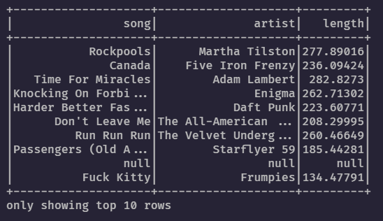


#### 2. Clean and Explore Data

**Summary about mini Sparkify dataset and comments from exploring the data:**

- `286500` rows
- `18` columns
- `8346` have no values for userId and most of the other columns are also null. It occurs when authentication level in the auth column is either Guest of Logged Out. These rows are dropped from the dataset.
- there is no duplicates in the medium size dataset
- There is no empty sessionId values.
- logs have been gathered from `1st October 2018 (02:00:11)` to `3rd of December 2018 (02:11:16)`
- users registrations are from `18th of March 2017` to `26th of November 2018`.
- `225` unique users
- `2312` unique sessions
- `23 %` of the users have churned - **it is not a balanced dataset.**


**Data cleaning steps:**

* **8346 UserIds** with empty string values have been dropped from the dataset. When **userId** has empty string, it corresponds to the `auth` column being either `Logged Out` or `Guest` values.
* **ts** and **registration** columns have been converted from unix time to datetime
* **hour** and **day** of the month was extracted from the ts (time) column (not used in the current version for feature engineering)
* **churn** was defined when **page** column logged  **'Cancellation Confirmation'** interaction


 **Data Analysis**

Summary statistics for a number of columns can be seen below. 

**gender**

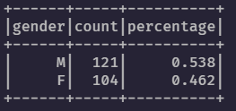

**level**

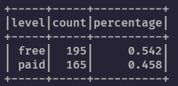

**page**

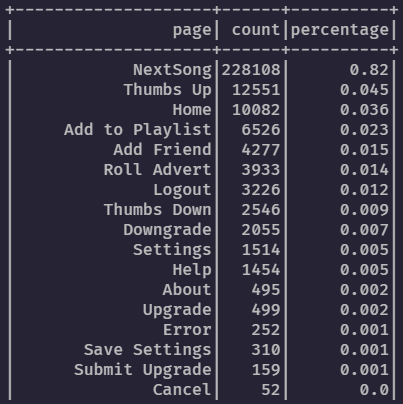

**status**

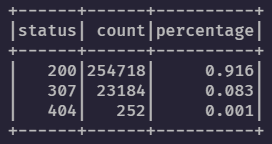

**churn**

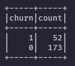


#### 3. **Create Features**

I have created 8 features that cover the observation period:

* **friends_count** - total count of friends a user has
* **thumbs_up_count** - total count of thumbs ups per user
* **thumbs_count_down** -  total count of thumbs downs per user
* **error_count** -  total count of errors per user
* **artist_count **-  total count of artists a user has listened to
* **song_count** -  total count of songs a user has listened to
* **gender** - gender of a user (encoded as 0 - female, 1- male)
* **session_time_mean** - mean session time per user

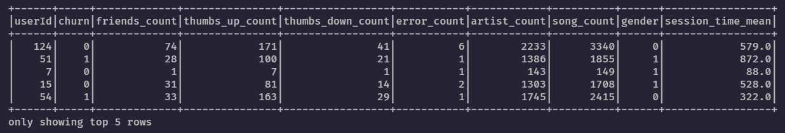

After performing an inner join between all of the calculated features, the number of users reduced from **225 to 115**.

**Pairplot of all features hued by churn column**

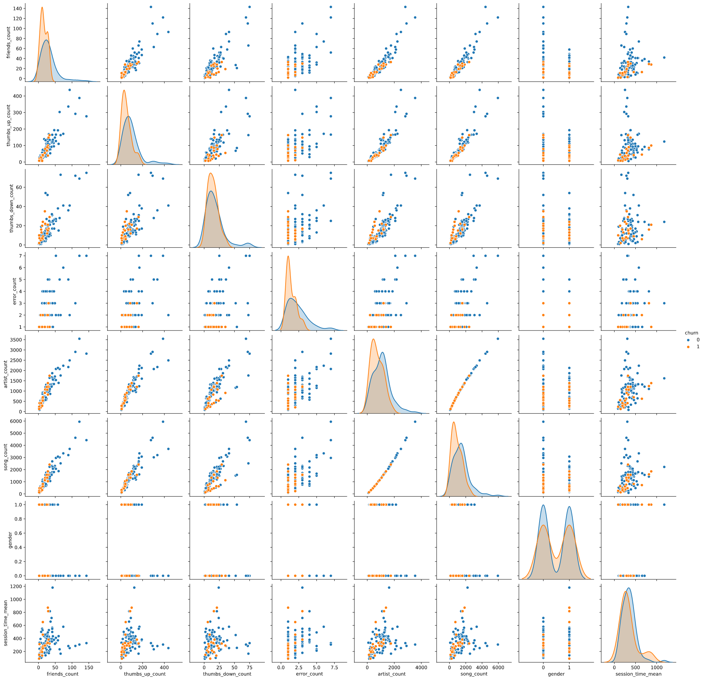

**Any correlation between features?**

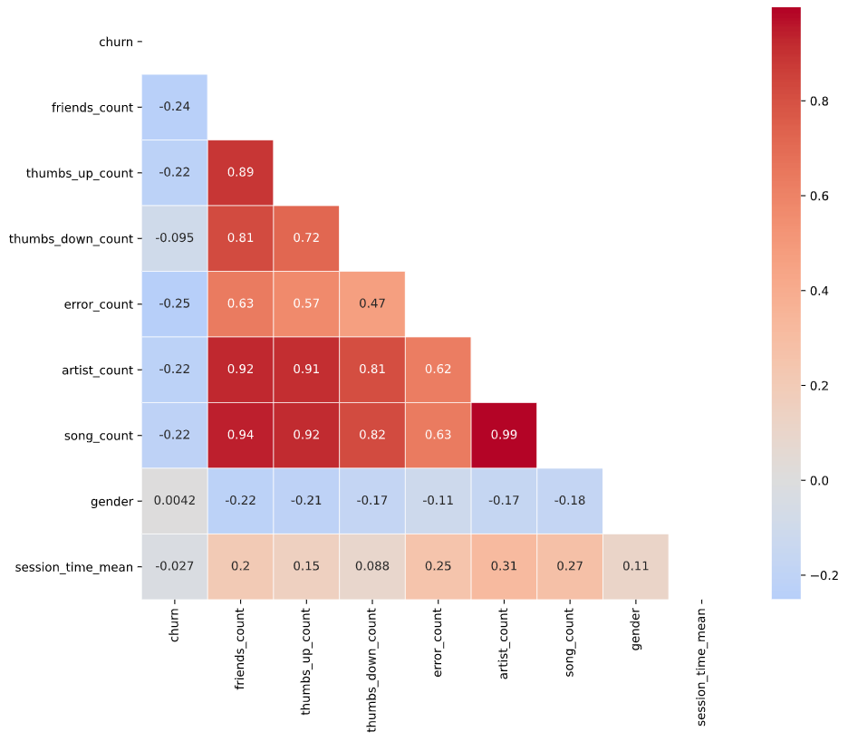

From the correlation matrix we can see there are collinearity between the features. I decided to drop one of the features that are colinear and have correlation factor larger than 0.9 which is **artist_count** column.

#### **4. Modeling**

**Feature dataset summary:**

- 7 numerical features - 'friends_count', 'thumbs_up_count', 'thumbs_down_count', 'error_count', 'song_count', 'session_time_mean',  'gender'

Dataset was split into train and test, in a ratio of 70:30 which ended up with 71 rows in train and 44 rows in test data.

**Metric:**

* F1 score

  * 

* Results:

  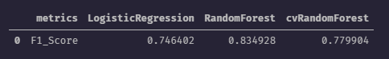

**Transformation pipeline:**

* VectorAssembler
  * 
* StandardScaler
  * 
* Logistic Regression
  * 
* Random Forest
  * 


**Model Tuning**

* ParametersGrid

  * ```
    parametersGrid = (ParamGridBuilder()
                 .addGrid(rand_forest.maxDepth, [2, 6, 8]) # default = 5
                 .addGrid(rand_forest.maxBins, [16, 32, 64]) # default: 32
                 .addGrid(rand_forest.numTrees, [10, 20, 30]) # default: 20
                 .build())
    ```

    

* CrossValidator

  * 5 folds


**Feature Importance**

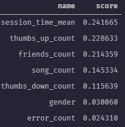


## Licence and Acknowledgements

**Useful links:**

- https://www.youtube.com/watch?v=CdHuLGuU2c4
- https://medium.com/@aieeshashafique/exploratory-data-analysis-using-pyspark-dataframe-in-python-bd55c02a28523
- https://towardsdatascience.com/a-brief-introduction-to-pyspark-ff4284701873
- https://databricks.com/blog/2017/10/30/introducing-vectorized-udfs-for-pyspark.html
- https://towardsdatascience.com/handyspark-bringing-pandas-like-capabilities-to-spark-dataframes-5f1bcea9039e
- https://github.com/dvgodoy/handyspark
- https://towardsdatascience.com/handyspark-bringing-pandas-like-capabilities-to-spark-dataframes-5f1bcea9039e
- https://changhsinlee.com/pyspark-udf/
- https://medium.com/@lukazaplotnik/sparkify-churn-prediction-with-pyspark-da50652f2afc
- https://heartbeat.fritz.ai/seaborn-heatmaps-13-ways-to-customize-correlation-matrix-visualizations-f1c49c816f07
- https://towardsdatascience.com/why-exclude-highly-correlated-features-when-building-regression-model-34d77a90ea8e
- https://www.timlrx.com/2018/06/19/feature-selection-using-feature-importance-score-creating-a-pyspark-estimator/
- https://medium.com/@naomi.fridman/install-pyspark-to-run-on-jupyter-notebook-on-windows-4ec2009de21f


If you would like to do further analysis or produce alternate visualizations of the data, it is available below under a **Creative Commons CC0 1.0 Universal (CC0 1.0) "Public Domain Dedication" license.**

Thanks Udacity for an interesting and useful project as a part of the [Data Science Nanodegree](https://www.udacity.com/course/data-scientist-nanodegree--nd025).

